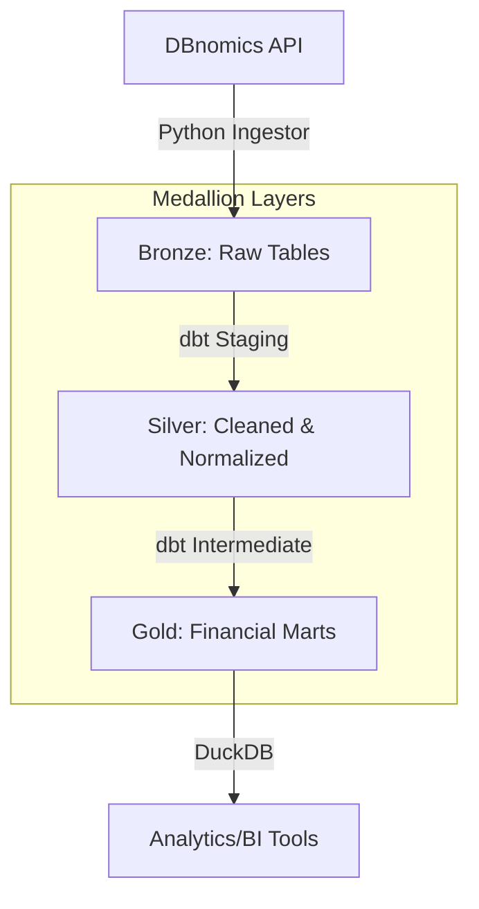

# 🏆 Gold Intelligence Framework (100% API-Driven)

Professional Market Data Platform using a Medallion Architecture (Bronze, Silver, Gold).

## 📊 Architecture Overview
This project implements a "Self-Documenting Pipeline" that aggregates global financial time series exclusively via the **DBnomics API**.



## 🏗 Tech Stack
- **Database:** DuckDB (Storage)
- **Transformation:** dbt (Logic & Modeling)
- **Ingestion:** Python (Modular `DBnomicsIngestor`)
- **Reporting:** dbt-docs & Markdown

## 📂 Project Structure
- `gold_dbt/`: dbt project root.
  - `models/staging/`: Silver Layer - Normalization (e.g., Tons conversion).
  - `models/intermediate/`: Silver Layer - Analytics (e.g., Pearson Correlation).
  - `models/marts/`: Gold Layer - Business-ready views.
- `ingest_manager.py`: Ingestion framework with idempotency and metadata tracking.
- `main.py`: Central orchestration (Ingest -> dbt Run -> dbt Test).
- `logs/`: Traceability for all pipeline steps.

## 🚀 Execution
To run the full pipeline, ensure dependencies are installed and execute:
```bash
pip install duckdb dbt-duckdb pandas dbnomics
python main.py
```

## 📖 Documentation Standard
- **Google-Style Docstrings:** All Python components.
- **dbt Docs:** Column-level descriptions in `schema.yml`.
- **Automated Tests:** Integrity and value thresholds for financial data.
