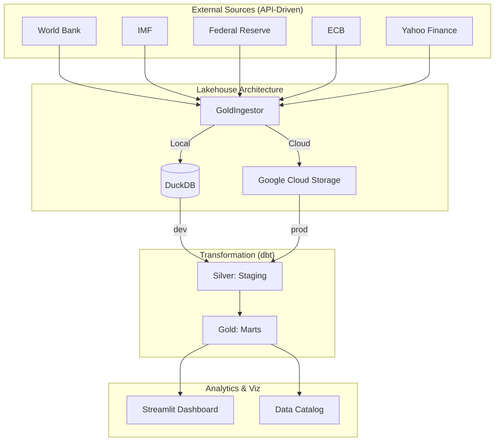

# 🏆 Gold Intelligence Framework (GIF)
### *End-to-End Hybrid-Cloud Data Platform for Global Market Analysis*


## 1. Problem Statement & Objective
Analyzing the global gold market typically requires aggregating fragmented data from various institutional sources (IMF, World Bank, FED, ECB) and market providers (Yahoo Finance). **The core challenge** for financial analysts is:
*   **Manual Fragmentation:** Data exists in different frequencies (daily vs. monthly) and units (ounces vs. tonnes).
*   **Metric Complexity:** Calculating advanced indicators like 12-month rolling Pearson correlations between real interest rates and gold prices is error-prone in spreadsheets.
*   **Environment Parity:** Moving from a local research environment to a scalable cloud production stack often requires significant code changes.

**The Objective**: To build an automated, environment-aware data platform that ingests, cleans, and transforms raw institutional data into a validated **Gold Analytics Mart**, enabling clear visibility into market drivers and valuation regimes.

---

## 2. Architecture & Tech Stack

This project implements a **Modern Data Stack** with a focus on **Environment Parity**:

*   **Infrastructure (IaC):** [Terraform](https://www.terraform.io/) for GCP (GCS & BigQuery) + [Docker](https://www.docker.com/) for local orchestration.
*   **Workflow Orchestration:** [Apache Airflow](https://airflow.apache.org/) managing the Medallion pipeline.
*   **Data Warehouse:** [DuckDB](https://duckdb.org/) (Local Dev) and [Google BigQuery](https://cloud.google.com/bigquery) (Production).
*   **Transformation Layer:** [dbt](https://www.getdbt.com/) implementing a unified **Medallion Architecture** (Bronze, Silver, Gold).
*   **Visual Analytics:** [Streamlit](https://streamlit.io/) for an interactive, data-driven dashboard.



---

## 3. Engineering Excellence

### 🛠️ Hybrid-Environment Design
The framework is designed to switch between two worlds via `.env` variables without code changes:
*   **Local Mode:** Uses DuckDB for 0€ cost, fast iteration, and offline development.
*   **Cloud Mode:** Uses GCS for the Bronze Layer and BigQuery for analytical processing.

### 📊 Data Warehouse Optimization
*   **Materialization Strategy:** Staging models are kept as `views` for data freshness; analytical Marts are materialized as `tables` for sub-second dashboard performance.
*   **Idempotent Ingestion:** The Python-based `GoldIngestor` follows an "Upsert" pattern (Delete before Insert) to prevent duplicates.

### ✅ Data Integrity & Trust
We prioritize data reliability with **automated dbt tests**:
*   **Uniqueness:** Ensuring no duplicate records in price and reserve time-series.
*   **Range Validations:** Validating that rolling correlations remain within the mathematical bounds of `[-1, 1]`.
*   **Completeness:** Ensuring zero null values in critical columns for the "Valuation Index".

---

## 4. Key Analytical Insights
The platform doesn't just show charts; it computes high-impact financial metrics:

*   **Rolling Pearson Correlation:** Measures the 12-month relationship between **10Y Real Interest Rates** and Gold.
*   **Gold Valuation Index:** A weighted composite score (0-100) combining Central Bank accumulation (40%), Currency strength (30%), and Safe Haven status (30%).

---

## 5. Quickstart Guide

### Local Installation:
1.  **Install Environment:** `make install` (uses `uv` for deterministic dependencies).
2.  **Run Pipeline:** `make pipeline` (runs Ingestion -> dbt run -> dbt test).
3.  **Launch Dashboard:** `make dashboard` (Default: http://localhost:8501).

### Docker Deployment:
```bash
docker-compose build
docker-compose up -d airflow
# Retrieve the generated admin password:
make get-airflow-pass
```
Access Airflow at http://localhost:8080.

### Terraform (Infrastructure as Code):
Navigate to `infrastructure/terraform/` and run:
```bash
terraform init
terraform apply -var="project_id=YOUR_PROJECT_ID"
```

---

## 👨‍💻 Project Structure
```text
.
├── gold_dbt/              # dbt Project (SQL Transformation Logic)
├── dags/                  # Airflow DAGs (Workflow Orchestration)
├── infrastructure/        # Terraform (GCP) & Configuration
├── data/bronze/           # Local Data Lake (Parquet Files)
├── dashboard.py           # Streamlit Analytical Interface
├── ingest_manager.py      # Environment-Aware Ingestion Engine
└── Makefile               # Enterprise Command Center
```

---
*Developed with Gemini CLI | 2026*
