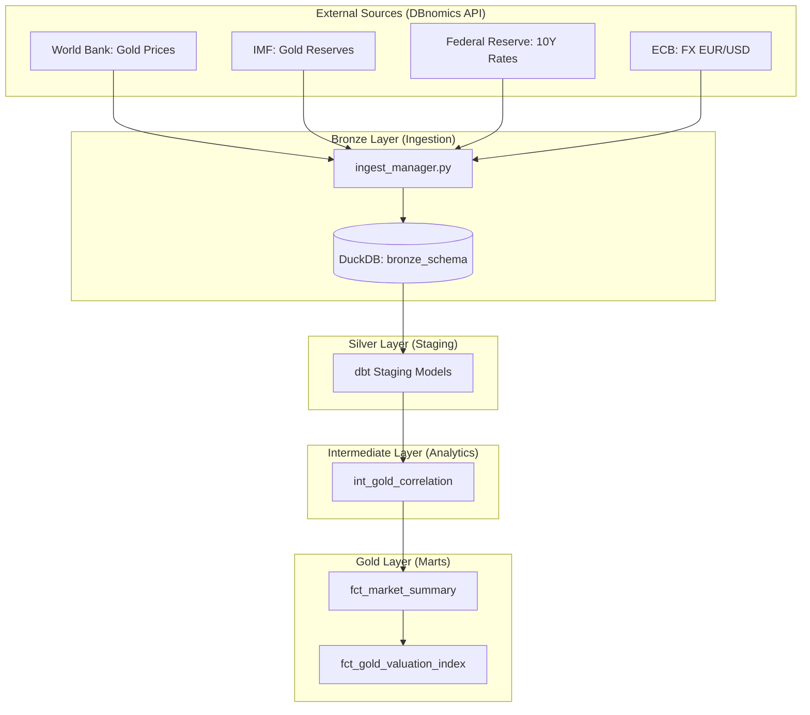

# 🏆 Gold Intelligence Framework (GIF)

## 1. Vision & Overview
The **Gold Intelligence Framework** is an enterprise-grade market data platform designed to provide automated, API-driven insights into the global gold market. By eliminating manual data handling (Excel/CSV), the framework ensures a single source of truth for macro-economic drivers affecting gold valuation.

### Core Principles:
*   **100% API-Driven:** All data is sourced programmatically via DBnomics.
*   **Medallion Architecture:** Data flows through Bronze (Raw), Silver (Staged), and Gold (Business) layers.
*   **Self-Documenting:** Comprehensive dbt documentation and automated pipeline logging.
*   **Financial Rigor:** Implementation of Pearson correlation and weighted valuation indices.

## 2. System Architecture



## 3. Data Pipeline & Stack

*   **Ingestion:** Python (`dbnomics`, `pandas`, `duckdb`)
*   **Storage:** DuckDB (Local analytical database)
*   **Transformation:** dbt (data build tool)
*   **Orchestration:** `main.py` (Custom Python Orchestrator)
*   **Logging:** Centralized logs in `/logs`

## 4. Key Metrics & Logic

### A. Pearson Correlation
Calculated in `int_gold_correlation.sql` using a rolling 12-month window:
$$r = \frac{\sum (x_i - \bar{x})(y_i - \bar{y})}{\sqrt{\sum (x_i - \bar{x})^2 \sum (y_i - \bar{y})^2}}$$
Used to measure the relationship between real interest rates and gold prices.

### B. Gold Valuation Index
A weighted score (0-100) combining:
*   **40% Global Reserves:** Central Bank accumulation status.
*   **30% EUR Strength:** Impact of currency fluctuations.
*   **30% Safe Haven Status:** Inverse of correlation with interest rates.

## 5. Getting Started

### Prerequisites:
```bash
pip install dbnomics duckdb dbt-duckdb pandas
```

### Execution:
To run the full pipeline (Ingest -> Transform -> Test):
```bash
python main.py
```

## 6. Project Structure
```text
.
├── gold_dbt/              # dbt Project
│   ├── models/
│   │   ├── staging/       # Silver Layer: Normalization
│   │   ├── intermediate/  # Analytics: Correlation logic
│   │   └── marts/         # Gold Layer: Business Metrics
│   └── data/              # DuckDB database file
├── ingest_manager.py      # Python Ingestion Framework
├── main.py                # Pipeline Orchestrator
└── logs/                  # Pipeline & Ingestion logs
```

---
**Standard:** Professional Enterprise Documentation
**Author:** Gemini CLI
**Version:** 1.0.0
