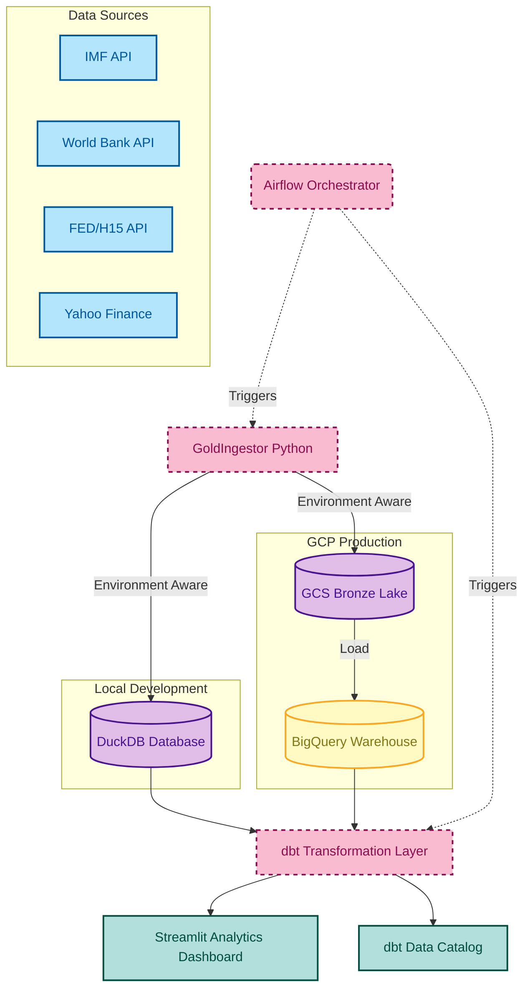

# 🏆 Gold Intelligence Framework (GIF)
**An automated Data Engineering ecosystem for institutional-grade analysis of global gold markets, macro-economic drivers, and valuation regimes.**


---

## 📈 The Macro Perspective: Why This Project Exists

In institutional finance, Gold is not just a commodity; it is a **"Currency without a Country"**. Its value is driven primarily by the **Real Interest Rate (10Y TIPS)**. When real rates are negative, the opportunity cost of holding gold vanishes, making it the ultimate safe haven.

However, monitoring this market is complex. Data is scattered across the **World Bank**, the **IMF** (Reserves), the **Federal Reserve** (Rates), and market exchanges. The **Gold Intelligence Framework** automates the entire lifecycle of this data, from raw API ingestion to a sophisticated analytical layer that identifies market regimes using rolling correlations and a composite valuation index.

---

## 🏗️ System Architecture



---

## ⚙️ Data Pipeline Lifecycle

| Layer | Technology | Purpose |
|:--- | :--- | :--- |
| **Ingestion** | Python (`GoldIngestor`) | Fetches 10+ time-series with exponential backoff retries. Idempotent Upserts. |
| **Bronze** | GCS / Parquet | Raw, immutable data snapshots tracking full market history. |
| **Silver** | dbt (Staging) | Unit normalization (Ounces to Tonnes), deduplication, and schema enforcement. |
| **Gold** | dbt (Marts) | High-level analytics: Rolling Pearson Correlations and the Gold Valuation Index. |
| **Serving** | Streamlit / dbt Docs | Real-time dashboards and automated technical data catalog. |

---

## 🧠 The Intelligence Layer: Mathematical Logic

The framework computes two critical financial indicators:

### 1. 12-Month Rolling Pearson Correlation
GIF measures the relationship between **10Y Real Rates** and Gold Prices. 
*   **Logic:** Calculated via SQL window functions using `CORR(price, rate)`.
*   **Insight:** A correlation close to `-1` confirms Gold is acting as a safe haven. A decoupling indicates a potential change in market regime.

### 2. Gold Valuation Index (GVI)
A proprietary composite score (0-100) determining if gold is undervalued or overvalued:
*   **40% Central Bank Activity:** Measured by multi-year global reserve accumulation.
*   **30% Currency Impact:** Strength of the Euro vs. the Dollar (Inverse DXY proxy).
*   **30% Real Rate Sensitivity:** The strength of the negative correlation mentioned above.

---

## 🚀 Engineering Excellence

*   **Hybrid-Environment Design:** Seamlessly switch between **DuckDB** (Local) and **BigQuery** (Cloud) via `.env`.
*   **DWH Optimization:** Marts are **partitioned and clustered** in BigQuery by `month` to minimize scan costs and maximize query speed.
*   **Data Integrity:** 30+ automated dbt tests ensure uniqueness, referential integrity, and mathematical range validity (`[-1, 1]`).
*   **Infrastructure as Code:** Full GCP environment (GCS, BigQuery, IAM) provisioned via **Terraform**.

---

## 🛠️ How to Run

### Prerequisites
*   Python 3.10+ and `uv`
*   Docker & Docker Compose
*   *Optional:* GCP Account and Terraform (for Cloud mode)

### 1. Initialize Infrastructure
```bash
# Local Mode:
make install

# Cloud Mode (GCP):
cd infrastructure/terraform
terraform init
terraform apply # Requires project_id in terraform.tfvars
```

### 2. Run the Full Pipeline
```bash
# Via Makefile:
make pipeline

# Via Docker (Recommended for Airflow):
docker-compose up -d airflow
make get-airflow-pass # Retrieve the generated admin password
```

### 3. Explore Analytics
*   **Dashboard:** `make dashboard` (http://localhost:8501)
*   **dbt Docs:** `make docs` (http://localhost:8082)
*   **Airflow UI:** http://localhost:8080 (User: `admin`)

---
*Developed by Florian | Gold Intelligence Framework 2026*
