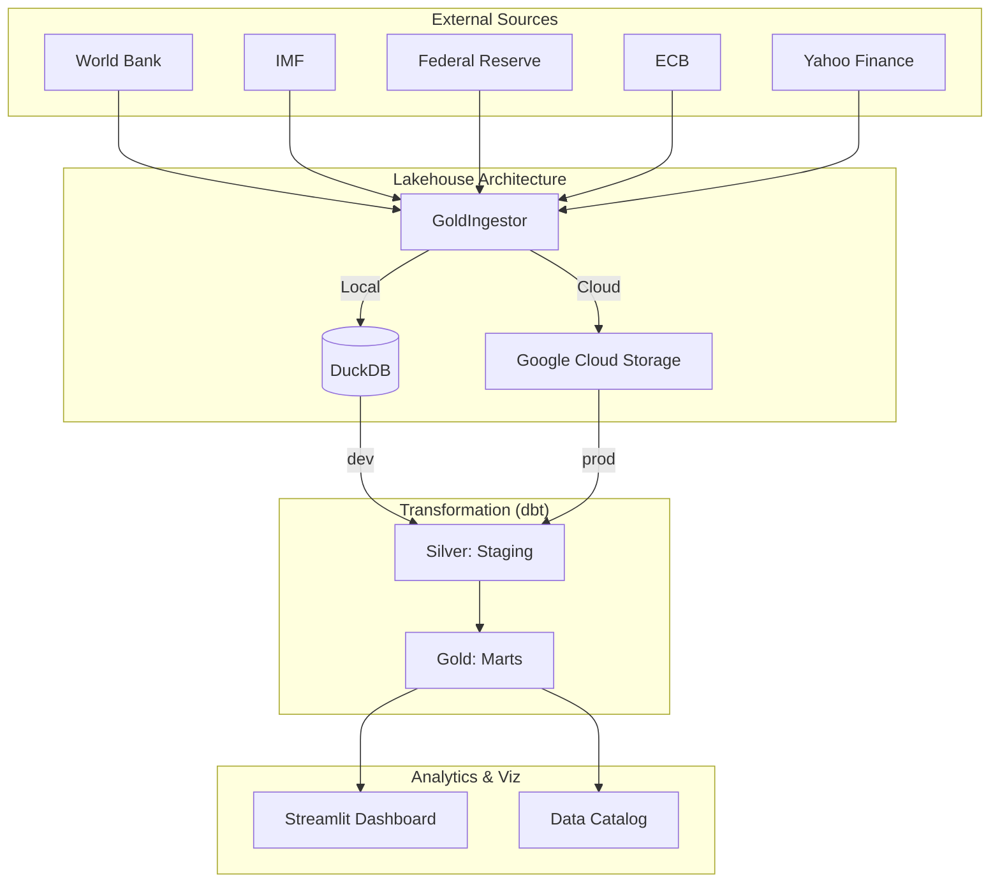

# 🏆 Gold Intelligence Framework

## 1. Vision & Overview
The **Gold Intelligence Framework (GIF)** is an enterprise-grade market data platform designed for automated insights into the global gold market. It features an **Environment-Aware** design, allowing seamless transitions between local development (DuckDB) and production cloud environments (BigQuery/GCS).

### Core Principles:
*   **Hybrid-Cloud Architecture:** Single codebase for Local (DuckDB) and Cloud (GCS/BigQuery) operations.
*   **Medallion Architecture:** Structured data flow through Bronze, Silver, and Gold layers.
*   **Financial Rigor:** Advanced analytics including rolling Pearson correlations and macro-valuation models.
*   **Modern Data Stack:** Powered by `uv`, `dbt`, `DuckDB`, and `Streamlit`.

## 2. System Architecture



## 3. Data Pipeline & Stack

*   **Ingestion:** Python (`GoldIngestor`) - Environment-aware, idempotent upserts.
*   **Warehouse:** DuckDB (Local) / BigQuery (Cloud Production).
*   **Transformation:** dbt (data build tool) - handles normalization and complex math.
*   **Orchestration:** Integrated Python Orchestrator (`main.py`) or Airflow DAG.
*   **Dependency Management:** `uv` for Python environment management.

## 4. Key Metrics & Analysis

### A. Rolling Pearson Correlation (`fct_gold_correlation`)
Measures the 12-month rolling relationship between **10Y Real Interest Rates** and **Gold Prices**.
*   **Significance:** Historically, gold has a strong negative correlation with real rates.

### B. Gold Valuation Index (`fct_gold_valuation_index`)
A composite score (0-100) determining if gold is undervalued or overvalued based on:
*   **Central Bank Activity:** Accumulation trends.
*   **Currency Drivers:** Strength of the USD (DXY).
*   **Macro Environment:** Interest rate trends and safe-haven demand.

## 5. Quickstart Guide

### Local Installation:
This project uses a `Makefile` for streamlined operations.
1.  **Install:** `make install`
2.  **Initialize Pipeline:** `make pipeline`
3.  **Launch Dashboard:** `make dashboard` (Default: http://localhost:8501)

### Docker Deployment:
For a fully isolated environment:
1.  **Build:** `docker-compose build`
2.  **Run Pipeline:** `docker-compose run pipeline`
3.  **Start Dashboard:** `docker-compose up dashboard`

## 6. Project Structure
```text
.
├── gold_dbt/              # dbt Project (Transformation Logic)
├── data/bronze/           # Local Data Lake (Parquet Files)
├── research/              # API Exploration & Research Scripts
├── Makefile               # Enterprise Command Center
├── docker-compose.yml     # Container Orchestration
├── main.py                # Pipeline Entrypoint
└── ingest_manager.py      # Core Ingestion Engine
```

## 7. Reproducibility Requirements

To reproduce this framework from scratch, ensure the following requirements are met:

### Software & Environment
*   **Git:** For version control.
*   **Docker & Docker Compose:** Required for containerized execution (Airflow/Dashboard).
*   **Python 3.10+ & `uv`:** Recommended for local execution. `uv` handles all dependencies.

### API Access (Zero Credentials Required)
The framework is designed for maximum accessibility:
*   **DBnomics (IMF, WB, FED, ECB):** Public institutional data. **No API key required.**
*   **Yahoo Finance:** Market prices via `yfinance`. **No API key required.**

### Configuration (`.env`)
You must create a `.env` file in the root directory (refer to `.env.example`).
*   For **Local Mode**: Set `ENVIRONMENT=local` and `DBT_TARGET=dev`.
*   For **Cloud Mode**: Provide GCP credentials (Project ID, GCS Bucket, Service Account JSON path).

### Google Cloud (Optional for Production)
If deploying to GCP (BigQuery/GCS), you need:
1.  An active **GCP Project**.
2.  A **Service Account** with `BigQuery Admin` and `Storage Admin` roles.
3.  A **Cloud Storage Bucket** for the Bronze data layer.

