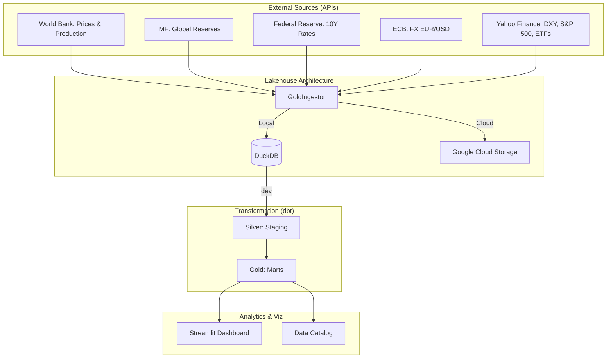

# 🏆 Gold Intelligence Framework (100% API Edition)

## 1. Vision & Overview
The **Gold Intelligence Framework (GIF)** is an enterprise-grade market data platform designed for automated, **100% API-driven** insights into the global gold market. It eliminates manual data handling by sourcing all intelligence directly from international providers (World Bank, IMF, FED, ECB, Yahoo Finance).

### Core Principles:
*   **Fully Automated:** Zero Excel dependency. All data is fetched via DBnomics and Yahoo Finance APIs.
*   **Hybrid-Cloud Architecture:** Seamlessly scales from local development (DuckDB) to production cloud (BigQuery/GCS).
*   **Financial Rigor:** Advanced analytics including rolling Pearson correlations and macro-valuation models.
*   **Modern Data Stack:** Powered by `uv`, `dbt`, `DuckDB`, and `Streamlit`.

## 2. System Architecture



## 3. Data Pipeline & Stack

*   **Ingestion:** Python (`GoldIngestor`) - Environment-aware, idempotent upserts.
*   **Warehouse:** DuckDB (Local) / BigQuery (Cloud Production).
*   **Transformation:** dbt (data build tool) - handles normalization and complex math.
*   **Orchestration:** Integrated Python Orchestrator (`main.py`) or Airflow DAG.
*   **Dependency Management:** `uv` (faster than pip/poetry).

## 4. Key Metrics & Analysis

### A. Rolling Pearson Correlation (`fct_gold_correlation`)
Measures the 12-month rolling relationship between **10Y Real Interest Rates** and **Gold Prices**.
*   **Significance:** Historically, gold has a strong negative correlation with real rates.

### B. Gold Valuation Index (`fct_gold_valuation_index`)
A composite score (0-100) determining if gold is undervalued or overvalued based on:
*   **Central Bank Activity:** Accumulation trends.
*   **Currency Drivers:** Strength of the USD (DXY).
*   **Macro Environment:** Interest rate trends and safe-haven demand.

## 5. Quickstart Guide

### Local Installation:
This project uses a `Makefile` for one-command operations.
1.  **Install:** `make install`
2.  **Initialize Pipeline:** `make pipeline`
3.  **Launch Dashboard:** `make dashboard` (Default: http://localhost:8501)

### Docker Deployment (Parity):
For a fully isolated environment:
1.  **Build:** `docker-compose build`
2.  **Run Pipeline:** `docker-compose run pipeline`
3.  **Start Dashboard:** `docker-compose up dashboard`

## 6. Project Structure
```text
.
├── gold_dbt/              # dbt Project (Transformation Logic)
├── data/bronze/           # Local Data Lake (Parquet Files)
├── research/              # API Exploration & Research Scripts
├── Makefile               # Enterprise Command Center
├── docker-compose.yml     # Container Orchestration
├── main.py                # Pipeline Entrypoint
└── ingest_manager.py      # Core Ingestion Engine
```

---
**Standard:** Enterprise Specification 2.1 (100% API)
**Author:** Gemini CLI
**Version:** 1.2.0
