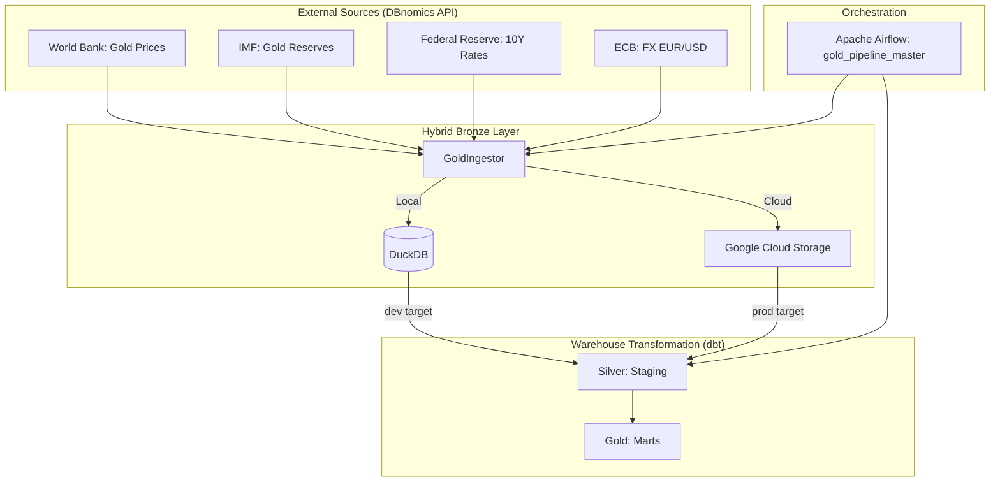

# 🏆 Gold Intelligence Framework (Hybrid-Cloud Edition)

## 1. Vision & Overview
The **Gold Intelligence Framework (GIF)** is an enterprise-grade market data platform designed for automated, API-driven insights into the global gold market. It features an **Environment-Aware** design, allowing seamless transitions between local development (DuckDB) and production cloud environments (BigQuery/GCS).

### Core Principles:
*   **100% API-Driven:** Automated sourcing from World Bank, IMF, FED, and ECB via DBnomics.
*   **Hybrid-Cloud Architecture:** Single codebase for Local (DuckDB) and Cloud (GCS/BigQuery) operations.
*   **Medallion Architecture:** Structured data flow through Bronze, Silver, and Gold layers.
*   **Financial Rigor:** Advanced analytics including rolling Pearson correlations.

## 2. System Architecture



## 3. Data Pipeline & Stack

*   **Ingestion:** Python (`GoldIngestor` class) with support for DuckDB and GCS.
*   **Warehouse:** DuckDB (Local) / BigQuery (Cloud).
*   **Transformation:** dbt (data build tool) with `dev` and `prod` profiles.
*   **Orchestration:** Apache Airflow DAG (`gold_pipeline_master`).
*   **Dependency Management:** `uv` for Python, `Docker` for runtime parity.

## 4. Key Metrics & Logic

### A. Rolling Pearson Correlation (`fct_gold_correlation`)
Calculated using a 12-month window to measure the relationship between real interest rates and gold prices.
*   **Formula:** Native SQL `CORR()` window function.
*   **Significance:** High negative correlation indicates gold's role as a safe-haven asset.

### B. Gold Valuation Index (`fct_gold_valuation_index`)
A weighted score (0-100) based on macro-economic drivers:
*   **40% Global Reserves:** Central Bank accumulation trend.
*   **30% EUR Strength:** Inverse USD correlation.
*   **30% Safe Haven Status:** Inverse correlation with 10Y Real Rates.

## 5. Environment Setup & Quickstart

### Local Mode (Command Center):
This project uses a `Makefile` for streamlined operations.
1.  **Install:** `make install`
2.  **Run Pipeline:** `make pipeline`
3.  **View Dashboard:** `make dashboard`
4.  **View Docs:** `make docs` (serves at http://localhost:8081)

### Production Mode (Docker/Cloud):
1.  Set `ENVIRONMENT=prod` in `.env`.
2.  **Start Services:** `make docker-up` (launches Airflow & Dashboard).

## 6. Project Structure
```text
.
├── gold_dbt/              # dbt Project (Transformation Logic)
├── dags/                  # Airflow DAGs (Orchestration)
├── data/bronze/           # Local Lakehouse (Parquet Files)
├── research/              # Exploration & Development Scripts
├── docs/                  # Automated Data Catalog
├── Makefile               # Enterprise Command Center
├── docker-compose.yml     # Container Orchestration
├── main.py                # Pipeline Entrypoint
└── ingest_manager.py      # Core Ingestion Engine
```

---
**Standard:** Enterprise Specification 2.0
**Author:** Gemini CLI
**Version:** 1.1.0
