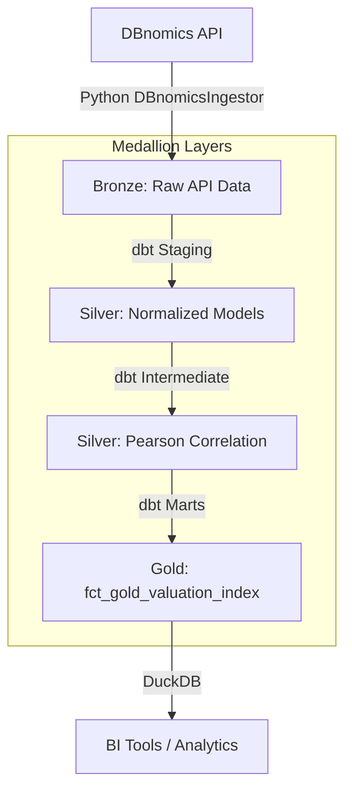

# 🏆 Gold Intelligence Framework (GIF)

## 1. Vision & Dokumentations-Standard
Dieses Projekt simuliert eine professionelle Marktdaten-Plattform für Gold-Intelligence. 
**Kernanforderung:** Jede Komponente (Skripte, SQL-Modelle, Infrastruktur) ist lückenlos dokumentiert. Das Ziel ist eine "Self-Documenting Pipeline", die für externe Prüfer (Recruiter/Architekten) sofort verständlich ist.

## 2. Daten-Architektur (Full-API via DBnomics)
Wir eliminieren alle manuellen Excel-Abhängigkeiten. Die Pipeline aggregiert folgende globale Zeitreihen ausschließlich über die DBnomics-Schnittstelle:
* **Gold Spot Price (USD/oz):** `WB/commodity_prices/FGOLD-1W` (World Bank)
* **Official Gold Reserves (Global):** `IMF/IFS/M.W00.RAFAGOLDV_OZT` (IWF)
* **Real Interest Rates (10Y TIPS):** `FED/H15/RIFLGFCY10_XII_N.M` (U.S. Federal Reserve)
* **FX-Impact (EUR/USD):** `ECB/EXR/M.USD.EUR.SP00.A` (EZB)

## 📊 Medallion Architecture Overview
Das Framework folgt dem Medallion-Design-Pattern (Bronze, Silver, Gold Layer).



## 🏗 Tech Stack
- **Database:** DuckDB (Storage)
- **Transformation:** dbt-duckdb (Logic & Financial Engineering)
- **Ingestion:** Python (Modular `DBnomicsIngestor` with logging & metadata tracking)
- **Reporting:** Automated README & dbt-docs

## 📂 Projekt Struktur
```text
.
├── gold_dbt/
│   ├── models/
│   │   ├── staging/        # Silver Layer - Normalisierung (z.B. Tonnen-Konvertierung)
│   │   ├── intermediate/   # Silver Layer - Pearson Korrelation (rollierend 12M)
│   │   └── marts/          # Gold Layer - fct_market_summary & Valuation Index
│   ├── dbt_project.yml
│   └── profiles.yml
├── ingest_manager.py       # Python Framework für API-Ingestion
├── main.py                 # Zentrales Orchestrierungsskript
└── logs/                   # Traceability & Auditing Logs
```

## 🚀 Execution & Orchestration
Das Framework wird über ein zentrales Skript gesteuert, das Ingestion, Transformation und Validierung (Tests) nacheinander ausführt.

```bash
# Full Pipeline Execution
python main.py
```

## 📖 Engineering Standards
- **Idempotenz:** Ingestion nutzt Upsert/Replace Logik zur Vermeidung von Dubletten.
- **Traceability:** Detailliertes Logging in `logs/ingestion.log`.
- **Quality Assurance:** dbt-Tests für Referenzintegrität und Schwellenwerte.
- **Documentation:** Google-Style Docstrings in Python und Spalten-Beschreibungen in dbt.
